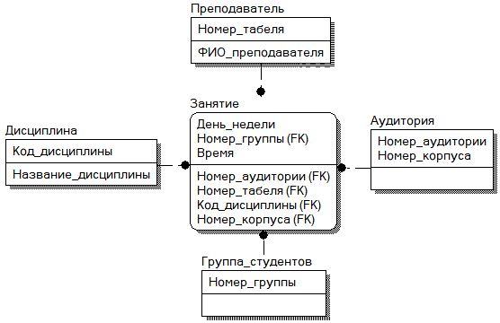

# Базы данных (2018)

## ЛР2. Построение схемы базы данных с использованием модели «Сущность-связь».
Приобретение навыков анализа предметной области, построение модели сущность-связь для заданной предметной области.

### Предметная область: 
Учебно-методический отдел (расписание занятий).

### Основные предметно-значимые сущности: 
Дисциплины, Аудитории, Группы студентов, Преподаватели.

### Основные предметно-значимые атрибуты сущностей:
*	дисциплины – название;
*	аудитории – название или номер аудитории;
*	группы студентов – название или номер группы;
*	преподаватели – фамилия, имя, отчество.

### Основные требования к функциям системы:
*	выбрать все занятия с указанием аудитории по группам или определенной группе;
*	подсчитать количество часов занятий в неделю по группам или определенной группе;
*	выбрать все занятия с указанием аудиторий по преподавателям или определенному преподавателю;
*	подсчитать количество часов занятий по преподавателям или определенному преподавателю;
*	выбрать все дисциплины, которые не указаны в расписании;
*	выбрать всех преподавателей, которые не указаны в расписании;
*	подсчитать общее количество часов занятий в неделю по аудиториям или определенной аудитории.
 
### Последовательность выполнения работы:
1)	выделите необходимый набор сущностей, отражающих предметную область (в соответствии с вариантом задания) и информационные потребности пользователей;
2)	определите необходимый набор атрибутов сущностей и классифицировать их по типу (идентифицирующие, описательные, простые, составные и т.д.);
3)	определите альтернативные и первичные ключи сущностей;
4)	определите связи между сущностями;
5)	проанализировав структуру связей, исключить избыточные;
6)	укажите необходимые свойства связей;
7)	определите тип сущности (стержневая, ассоциативная, характеризующая и т.д.);
8)	задайте необходимые ограничения целостности данных;
9)	постройте первичную схему БД (используя нотацию Питера Чена);
10)	 оформите отчет о выполнении лабораторной работы.

### Схема базы данных. Основные предметно-значимые сущности: 
*	дисциплина, 
*	аудитория, 
*	группа студентов, 
*	преподаватель,
*	расписание.

### Информационные потребности пользователей: 
1)	выбрать все занятия с указанием аудитории по группам или определенной группе;
2)	подсчитать количество часов занятий в неделю по группам или определенной группе;
3)	выбрать все занятия с указанием аудиторий по преподавателям или определенному преподавателю;
4)	подсчитать количество часов занятий по преподавателям или определенному преподавателю;
5)	выбрать все дисциплины, которые не указаны в расписании;
6)	выбрать всех преподавателей, которые не указаны в расписании;
7)	подсчитать общее количество часов занятий в неделю по аудиториям или определенной аудитории.

### Основные предметно-значимые атрибуты сущностей:
1)	дисциплина – название – идентифицирующий атрибут;
2)	аудитория – номер аудитории – идентифицирующий атрибут;
3)	группа студентов – номер группы – идентифицирующий атрибут;
4)	преподаватель – табельный номер – идентифицирующий атрибут; фамилия, имя, отчество – составной описательный атрибут;
5)	занятие – день недели – идентифицирующий атрибут; время – описательный атрибут.

### Альтернативные (АК) и первичные ключи (ПК) сущности:
1)	дисциплины – название – ПК;
2)	аудитории – номер аудитории – ПК;
3)	группы студентов – номер группы – ПК;
4)	преподаватели – табель номер – ПК; фамилия – АК, имя – АК, отчество – АК;
5)	занятие – день недели – ПК; время – АК.

### Тип сущностей:
1)	дисциплины – ассоциативная;
2)	аудитории – ассоциативная;
3)	группы студентов – ассоциативная;
4)	преподаватели – ассоциативная;
5)	занятие – стержневая.

### Ограничения целостности данных:
1)	дисциплина – строка, не должна содержать цифр;
2)	номер аудитории – положительное трёхзначное значение;
3)	номер группы – положительное четырёхзначное значение;
4)	табельный номер – положительное трёхзначное значение;
5)	фамилия, имя, отчество – строки, не должны содержать цифр, каждое слово начинается с заглавной буквы;
6)	день недели – один из дней недели формата «ПН»;
7)	время – формат «00:00».

### Свойства связей:
1)	бинарная полная связь между сущностями Преподаватель и Занятие является 1:1 по мощности;
2)	бинарная полная связь между сущностями Группа студентов и Занятие является 1:1 по мощности;
3)	бинарная полная связь между сущностями Занятие и Дисциплина является 1:1 по мощности;
4)	бинарная полная связь между сущностями Занятие и Аудитория является 1:1 по мощности.

## ЛР3

### Придумайте и напишите SQL запросы, которые будут необходимы для предметной области (в соответствии с вариантом задания):
* Запрос на выборку избранных полей таблицы, с использованием синонима (алиаса) и сортировкой записей (ORDER BY).
* Запрос с использованием сортировки (ORDER BY) и группировки (GROUP BY).
* Запрос с использованием предложения DISTINCT.
* Запрос с использованием операций сравнения.
* Запросы для предикатов: IN, BETWEEN, LIKE, IS NULL.
* Запросы с использованием агрегатных функций (COUNT, SUM, AVG, MAX, MIN ), производящие обобщенную групповую обработку значений полей (используя ключевые фразы GROUP BY и HAVING).
* Запрос на выборку данных из двух связанных таблиц. Выбрать несколько полей, по которым сортируется вывод.
* Многотабличный запрос с использованием внутреннего и внешнего соединения.
* Многотабличный запрос с использованием оператора UNION.
* Напишите SQL запросы, предусмотренные вариантом задания.
* Создайте SQL команды для модификации данных (INSERT, UPDATE, DELETE).

## ЛР4. Использование подзапросов и представлений
Приобретение навыков использования подзапросов в команде SQL SELECT. Создание и работа с представлениями.

### Придумайте и напишите SQL запросы, которые будут необходимы для предметной области (в соответствии с вариантом задания):
* Запрос с применением подзапроса в части WHERE команды SQL SELECT и в внутри предложения HAVING.
* Запрос с применением подзапроса с применением следующих операторов: ALL, EXIST, ANY.
* Создайте представления, основанные на запросах из пункта 1.
* Создайте представления с выборкой, сортировкой, группировкой, левым, правым и внешним объединением.
* Создайте обновляемые представления для всех таблиц. Проверьте работоспособность созданных представлений командами SQL: Select, Insert, Update и Delete.
* Для обновляемого представления примените команду WITH CHECK OPTION. Объясните смысл ее применения.

## ЛР5. абота с транзакциями
Изучение механизма формирования транзакций.

### Содержание работы: 
изучение основ создания транзакций, сохранения изменений, выполнения операций транзакции, организации отката в случае ошибки.

### Ход работы:
* Выберите любую таблицу, созданную в предыдущих лабораторных работах;
* Отключите режим автоматического завершения;
* Добавьте в выбранную таблицу новые записи, проверьте добавились ли они;
* Произведите откат транзакции, т. е. отмену произведенных действий;
* Откатите транзакцию оператором ROLLBACK(изменения не сохранились);
* Воспроизведите транзакцию и сохраните действия оператором COMMIT.
